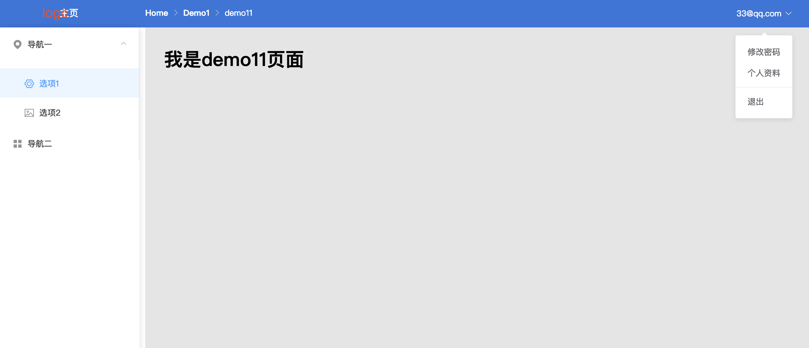

### 一、`admin-web`项目介绍

`admin-web`项目是基于`vue-cli3`中`typescript`搭建起来的项目,前端`ui`库使用的是`element-ui`组件库

### 二、项目的启动及几个环境的介绍

- 1、下载后安装依赖包

  ```js
  npm install
  // 或
  yarn install
  ```

- 2、启动开发环境代码

  ```js
  npm run dev
  ```

- 3、项目中配置了`dev`、`production`、`fat`、`uat`四个环境,每个环境配置了 3 个基础的`url`地址
- 4、实际开发项目配置后端接口请求的地址在`src/api`中不同的环境配置
- 5、自己写了一套存储过程作为存储用户信息用于登录拦截
  - 1.在`src/config`中配置常量

### 三、页面展示

- 1、登录页面

  

- 2、主页面

  
