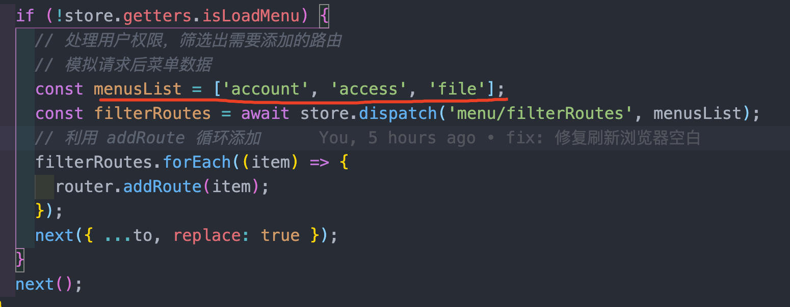

## `vue-admin`介绍

针对企业后台管理项目搭建的基础框架模型，实现基本的布局、登录权限、多环境区分、菜单权限、动态路由，如果你没有后端接口，[你可以使用nestjs后端项目](https://github.com/kuangshp/nestjs-mysql-api)

## 使用方式

* 1、下载代码
* 2、安装依赖包
* 3、运行项目

## 主页页面

* 1、登录页面

  

* 2、主要界面

  

* 3、需要动态显示左侧菜单

  
