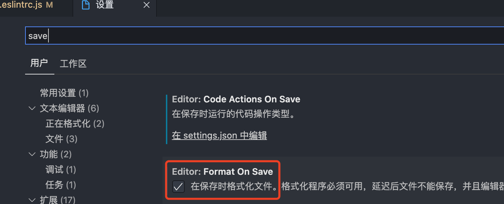
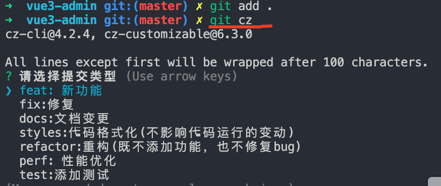

## 一、使用`vue-cli`脚手架创建一个`vue`项目

* 1、使用命令方式查看你本机安装的脚手架的版本

  ```properties
  vue -V
  ```

* 2、如果需要升级的时候使用下面命令

  ```properties
  npm update -g @vue/cli
  ```

* 3、使用命令的方式创建一个工程

  ```properties
  // 利用 vue-cli 创建项目 
  vue create vue3-admin // 进入模板选择
  Vue CLI v4.5.13
  ? Please pick a preset:
  Default ([Vue 2] babel, eslint)
  Default (Vue 3) ([Vue 3] babel, eslint)
  > Manually select features // 选择手动配置
  // ----------------------------------------------------------
  ? Check the features needed for your project: (*) Choose Vue version // 选择 vue 版本
  (*) Babel // 使用 babel
  ( ) TypeScript // 不使用 ts
  ( ) Progressive Web App (PWA) Support // 不使用 PWA (*) Router // 添加 vue-router
  (*) Vuex // 添加 vuex
  >(*) CSS Pre-processors // 使用 css 预处理器 (*) Linter / Formatter // 代码格式化
  ( ) Unit Testing // 不配置测试
  ( ) E2E Testing // // 不配置测试
  // ----------------------------------------------------------
  Choose a version of Vue.js that you want to start the project with 2.x
  >3.x//选择 vue3.0版本
  // ----------------------------------------------------------
  Use history mode for router? (Requires proper server setup for index fallback in production) (Y/n) n // 不使用 history模式 的路由 
  // ----------------------------------------------------------
  ? Pick a CSS pre-processor (PostCSS, Autoprefixer and CSS Modules are supported by default): > Sass/SCSS (with dart-sass) // 使用基于 dart-sass 的 scss 预处理器
  Sass/SCSS (with node-sass) Less
  Stylus
  // ----------------------------------------------------------
  ? Pick a linter / formatter config: ESLint with error prevention only ESLint + Airbnb config
  > ESLint + Standard config // 使用 ESLint 标准代码格式化方案 ESLint + Prettier
  // ----------------------------------------------------------
  ? Pick additional lint features: (*) Lint on save //
  >(*) Lint and fix on commit // 保存时 && 提交时，都进行 lint
  // ----------------------------------------------------------
  ? Where do you prefer placing config for Babel, ESLint, etc.? > In dedicated config files // 单独的配置文件
  In package.json
  // ----------------------------------------------------------
  (Use arrow keys)
  Save this as a preset for future projects? (y/N) n // 不存储预设

* 4、初始化后的`vue`版本号为`v 3.0.0`现在对其升级下

  ```properties
  npm i vue@3.2.8 vue-router@4.0.11 vuex@4.0.2
  ```

## 二、`eslint`代码格式化规范

* 1、默认创建的项目中带了`eslint`代码规范

  ```properties
  module.exports = {
    // 表示当前目录即为根目录，eslint规则将被限制到该目录下
    root: true,
    // env 表示开启eslint检测的环境
    env: {
      // 在node环境下启动eslint检测
      node: true
    },
    // eslint中基础配置需要继承的配置
    extends: [
      'plugin:vue/vue3-essential',
      '@vue/standard'
    ],
    // 解析器
    parserOptions: {
      parser: 'babel-eslint'
    },
    // 各种规则
    /**
     * "off" 或者 0 表示关闭规则
     * "warn" 或者1 表示开始警告级别的错误，但是不会退出程序
     * "error" 或者2 表示开始错误级别的错误，直接会退出程序
     */
    rules: {
      'no-console': process.env.NODE_ENV === 'production' ? 'warn' : 'off',
      'no-debugger': process.env.NODE_ENV === 'production' ? 'warn' : 'off'
    }
  }
  ```

  

## 三、项目中配置`prettier`格式化

* 1、在项目的根目录下创建一个`.prettierrc`的文件

  ```properties
  {
  	// 结尾要加分号
    "semi": true,
    // 单引号
    "singleQuote": true,
    // 对象多行的时候最后加,
    "trailingComma": "all",
    "tabWidth": 2,
    "printWidth": 200
  }
  ```

* 2、在`vscode`中开启保存代码的时候自动根据`prettier`格式化代码【**这一步是可选的**，后面可以使用`git`提交的时候自动格式化】

  

## 四、创建`git`提交代码规范

> 注意点:这个地方要求你的`npm`版本在7.x以上，如果不是使用命令升级`npm install -g npm`

* 1、电脑全局安装依赖包

  ```properties
  npm install -g commitizen
  ```

* 2、在项目中安装依赖包

  ```properties
  npm install cz-customizable -D
  ```

* 3、添加配置到`package.json`中

  ```json
  {
    ...
    "config": {
      "commitizen": {
        "path": "node_modules/cz-customizable"
      }
    }
  }
  ```

* 4、在项目的根目录下创建一个`.cz-config.js`的文件

  ```js
  module.exports = {
    // 可选类型
    types: [
      {
        value: 'feat',
        name: 'feat: 新功能',
      },
      {
        value: 'fix',
        name: 'fix:修复',
      },
      {
        value: 'docs',
        name: 'docs:文档变更',
      },
      {
        value: 'styles',
        name: 'styles:代码格式化(不影响代码运行的变动)',
      },
      {
        value: 'refactor',
        name: 'refactor:重构(既不添加功能，也不修复bug)',
      },
      {
        value: 'perf',
        name: 'perf: 性能优化',
      },
      {
        value: 'test',
        name: 'test:添加测试',
      },
      {
        value: 'revert',
        name: 'revert:回退',
      },
      {
        value: 'build',
        name: 'build:打包',
      },
    ],
    // 消息步骤
    messages: {
      type: '请选择提交类型',
      customScope: '请输入修改的范围(可选)',
      subject: '请简要描素提交(必须)',
      body: '请输入详细描述(可选)',
      footer: '请输入要关闭的issue(可选)',
      confirmCommit: '确认要使用以上信息提交?(y/n)',
    },
    // 默认长度
    subjectLimit: 72,
  };
  ```

* 5、使用`git cz`来代替`git commit`的方式提交代码

  

> 虽然上面的方式可以很好的提交代码，但是我们常见的`git`操作的提交命令是`git commit`不是每一个人都会使用或者记得使用`git cz`来提交代码的，因此这个需要限制下

* 6、在项目中安装依赖包

  > `commitlint`用于检查提交信息

  ```properties
  npm install @commitlint/config-conventional @commitlint/cli -d
  ```

* 7、在根目录下创建一个文件`commitlint.config.js`文件

  ```js
  module.exports = {
    //继承的规则
    extends: ['@commitlint/config-conventional'],
    // 定义规则
    roles: {
      'type-enum': [
        // 当前验证的错误级别
        2,
        // 在什么情况下进行验证
        'always',
        // 泛型内存(根据.cz-config.js中来配置)
        ['feat', 'fix', 'docs', 'styles', 'refactor', 'perf', 'test', 'revert', 'build'],
      ],
      // subject大小写不做校验
      'subject-case': [0],
    },
  };
  ```

* 8、安装依赖包

  > `husky`是`git hooks`工具

  ```properties
  npm install husky -d
  ```

* 9、启动`hooks`，生成`.husky`文件夹

  ```properties
  npx husky install     
  ```

* 10、修改`package.json`中命令

  ```json
  ...
  "scripts": {
      "serve": "vue-cli-service serve",
      "build": "vue-cli-service build",
      "lint": "vue-cli-service lint",
      "prepare": "husky install"
  },
  ...
  ```

* 11、运行`prepare`命令

  ```properties
  npm run prepare
  
  vue3-admin git:(master) ✗ npm run prepare
  
  > vue3-admin@0.1.0 prepare
  > husky install
  
  husky - Git hooks installed
  ```

* 12、将`commitlint`的`hook`添加到`husky`中，并指令在`commit-msg`的`hooks`下

  ```properties
  npx husky add .husky/commit-msg 'npx --no-install commitlint --edit "$1"'
  ```

  

## 五、配置`git`提交代码的时候自动格式化代码

> 虽然上面说了可以在`vscode`中配置每次保存的时候自动格式化代码，但是不是每个人都会这么做，因为需要在每次`git`提交的时候强制使用`eslint`和`prettier`来对代码进行格式化

* 1、使用`husky`监听`pre-commit`钩子,在`src`文件夹下全部的`js`和`vue`文件都要验证

  ```properties
  npx husky add .husky/pre-commit "npx eslint --ext .js,.vue src"
  ```

* 2、可以尝试`vscode`保存自动格式化代码是不是已经限制提交代码了

* 3、配置每次`git`提交的时候都自动格式化代码

  > `lint-staged`不需要安装，在项目生产的时候就自动安装了

* 4、修改`package.json`的配置

  ```json
  ...
  "lint-staged": {
    "src/**/*.{js,vue}": [
      "eslint --fix",
      "git add"
    ]
  }
  ...
  ```

* 5、修改`pre-commit`的文件内容

  ```properties
  #!/bin/sh
  . "$(dirname "$0")/_/husky.sh"
  
  # npx eslint --ext .js,.vue src
  npx lint-staged
  ```

* 6、尝试打乱代码格式，使用`git`提交