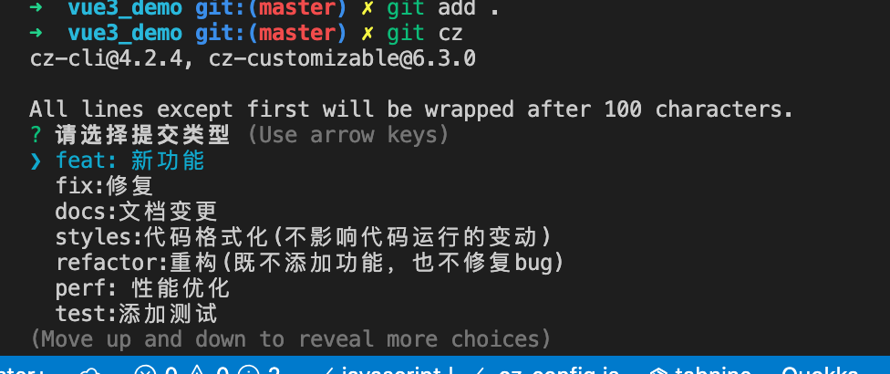

## 一、项目中配置`prettier`格式化

* 1、项目根目录下创建一个`.prettierrc`的文件

  ```properties
  {
  	// 结尾要加分号
    "semi": true,
    // 单引号
    "singleQuote": true,
    // 对象多行的时候最后加,
    "trailingComma": "all",
    "tabWidth": 2,
    "printWidth": 200
  }
  ```

  

## 二、配置`git`提交

* 1、电脑全局安装依赖包

  ```properties
  npm install -g commitizen
  ```

* 2、在项目中下载cz-customizable`插件

  ```properties
  npm install cz-customizable -D
  ```

* 3、添加配置到`package.json`中

  ```json
  {
      "config": {
      "commitizen": {
        "path": "node_modules/cz-customizable"
      }
    }
  }

* 4、在项目的根目录下创建一个`.cz-config.js`的文件

  ```javascript
  module.exports = {
    // 可选类型
    types: [
      {
        value: 'feat',
        name: 'feat: 新功能',
      },
      {
        value: 'fix',
        name: 'fix:修复',
      },
      {
        value: 'docs',
        name: 'docs:文档变更',
      },
      {
        value: 'styles',
        name: 'styles:代码格式化(不影响代码运行的变动)',
      },
      {
        value: 'refactor',
        name: 'refactor:重构(既不添加功能，也不修复bug)',
      },
      {
        value: 'perf',
        name: 'perf: 性能优化',
      },
      {
        value: 'test',
        name: 'test:添加测试',
      },
      {
        value: 'revert',
        name: 'revert:回退',
      },
      {
        value: 'build',
        name: 'build:打包',
      },
    ],
    // 消息步骤
    messages: {
      type: '请选择提交类型',
      customScope: '请输入修改的范围(可选)',
      subject: '请简要描素提交(必须)',
      body: '请输入详细描述(可选)',
      footer: '请输入要关闭的issue(可选)',
      confirmCommit: '确认要使用以上信息提交?(y/n)',
    },
    // 默认长度
    subjectLimit: 72,
  };
  ```

* 5、测试提交，不要使用`git commit`

  

## 三、限制提交

* 1、安装依赖包

  ```properties
  npm install @commitlint/config-conventional @commitlint/cli -d
  ```

* 2、在根目录下创建一个文件`commitlint.config.js`文件

  ```javascript
  module.exports = {
    //继承的规则
    extends: ['@commitlint/config-conventional'],
    // 定义规则
    roles: {
      'type-enum': [
        // 当前验证的错误级别
        2,
        // 在什么情况下进行验证
        'always',
        // 泛型内存
        ['feat', 'fic', 'docs'],
      ],
      // subject大小写不做校验
      'subject-case': [0],
    },
  };
  ```

* 3、安装`husky`

  ```properties
  npm install husky -d
  ```

* 4、在项目中运行命令

  ```properties
  npx husky install
  ```

* 5、修改`package.json`文件

  ```json
  {
      "scripts": {
        "serve": "vue-cli-service serve",
        "build": "vue-cli-service build",
        "lint": "vue-cli-service lint",
        "prepare": "husky install"
      }
  }
  ```

* 6、运行`prepare`命令

  ```properties
  npm run prepare
  ```

* 7、添加`commitlint`的`hook`到`husky`中

  ```properties
  npx husky add .husky/commit-msg 'npx --no-install commitlint --edit "$1"'
  ```

## 四、提交自动格式化

* 1、使用`husky`监听`pre-commit`钩子

  ```properties
  npx husky add .husky/pre-commit "npx eslint --ext .js,.vue src"
  ```

* 2、修改`package.json`文件

  ```json
  {
      "lint-staged": {
        "src/**/*.{js,vue}": [
          "eslint --fix",
          "git add"
        ]
      }
  }
  ```

* 3、修改`pre-commit`的文件内容

  ```properties
  #!/bin/sh
  . "$(dirname "$0")/_/husky.sh"
  
  # npx eslint --ext .js,.vue src
  npx lint-staged
  ```

  