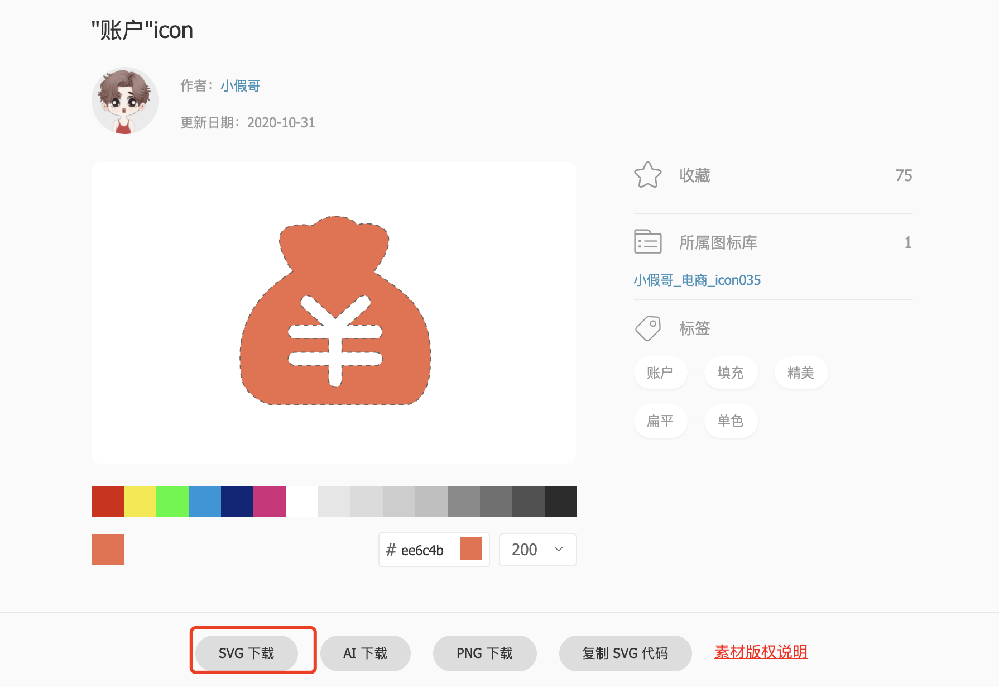

## 一、为什么要自定义`svg-icon`组件

* 1、在传统的`element ui`组件库中有些图标不能满足我们实际开发需求的时候，我们就要去借助[阿里字体图标库](https://www.iconfont.cn/)寻找到自己的图标，下载对应的`svg`文件存放到项目中，在自定义组件中引入就可以。

  

* 2、为了兼容我们自定义的和`element ui`组件库通用，我们自定义一个组件，在组件里面兼容两种写法的


## 二、实现自定义组件来兼容两种写法

* 1、定义一个方法来判断是`element ui`内部的还是自己本地加载的`svg`图标

  ```javascript
  /**
   * 判断是否为外部资源
   */
  export function isExternal(path) {
    return /^(https?:|mailto:|tel:)/.test(path);
  }
  ```

* 2、自定义组件用来显示字体图标

  ```vue
  <template>
    <div v-if="isExternal" :style="styleExternalIcon" class="svg-external-icon svg-icon" :class="className" />
    <!-- 自己使用svg的图标 -->
    <svg v-else class="svg-icon" :class="className" aria-hidden="true">
      <use :xlink:href="iconName" />
    </svg>
  </template>
  
  <script setup>
  import { isExternal as external } from '@/utils';
  import { defineProps, computed } from 'vue';
  const props = defineProps({
    icon: {
      type: String,
      required: true,
    },
    className: {
      type: String,
      default: '',
    },
  });
  
  // 判断是不是elementUi外部的图标
  const isExternal = computed(() => external(props.icon));
  
  /**
   * 外部图标样式
   */
  const styleExternalIcon = computed(() => ({
    mask: `url(${props.icon}) no-repeat 50% 50%`,
    '-webkit-mask': `url(${props.icon}) no-repeat 50% 50%`,
  }));
  /**
   * 项目内图标
   */
  const iconName = computed(() => `#icon-${props.icon}`);
  </script>
  
  <style lang="scss" scoped>
  .svg-icon {
    width: 1em;
    height: 1em;
    vertical-align: -0.15em;
    fill: currentColor;
    overflow: hidden;
  }
  
  .svg-external-icon {
    background-color: currentColor;
    mask-size: cover !important;
    display: inline-block;
  }
  </style>
  ```

* 3、项目的`src`下创建一个`icons`的文件夹

  ```shell
  ➜  icons git:(master) ✗ tree .
  .
  ├── index.js
  └── svg
      ├── account.svg # 自己刚刚下载的svg图标
  
  1 directory, 2 files
  ```

* 4、`src/icons/index.js`中实现自定义组件的注册

  ```javascript
  import SvgIcon from '@/components/SvgIcon';
  
  // https://webpack.docschina.org/guides/dependency-management/#requirecontext
  // 通过 require.context() 函数来创建自己的 context
  const svgRequire = require.context('./svg', false, /\.svg$/);
  // 此时返回一个 require 的函数，可以接受一个 request 的参数，用于 require 的导入。
  // 该函数提供了三个属性，可以通过 require.keys() 获取到所有的 svg 图标
  // 遍历图标，把图标作为 request 传入到 require 导入函数中，完成本地 svg 图标的导入
  svgRequire.keys().forEach((svgIcon) => svgRequire(svgIcon));
  
  export default (app) => {
    app.component('svg-icon', SvgIcon);
  };
  ```

* 5、在`main.js`中引入

  ```javascript
  import installIcons from './icons';
  const app = createApp(App);
  installIcons(app);
  ```

* 6、在`vue`文件中直接使用

  ```vue
  <template>
    <el-button type="primary">el-button</el-button>
  	<!--account就是svg的文件名-->
    <svg-icon icon="account"></svg-icon>
  </template>
  
  <script setup></script>
  
  <style scoped lang="scss"></style>
  ```

* 7、访问项目不出意外的话是不能访问出这个钱包的图标出来

## 三、配置对应的`loading`加载出自定义`svg`图标

* 1、安装依赖包

  ```shell
  npm install svg-sprite-loader -D
  ```

* 2、项目下创建一个`vue.config.js`的文件

  ```javascript
  const path = require('path');
  function resolve(dir) {
    return path.join(__dirname, dir);
  }
  
  module.exports = {
    chainWebpack(config) {
      // 设置 svg-sprite-loader
      config.module.rule('svg').exclude.add(resolve('src/icons')).end();
      config.module
        .rule('icons')
        .test(/\.svg$/)
        .include.add(resolve('src/icons'))
        .end()
        .use('svg-sprite-loader')
        .loader('svg-sprite-loader')
        .options({
          symbolId: 'icon-[name]',
        })
        .end();
    },
  };
  ```

* 3、重新运行项目，刷新浏览器

* 4、